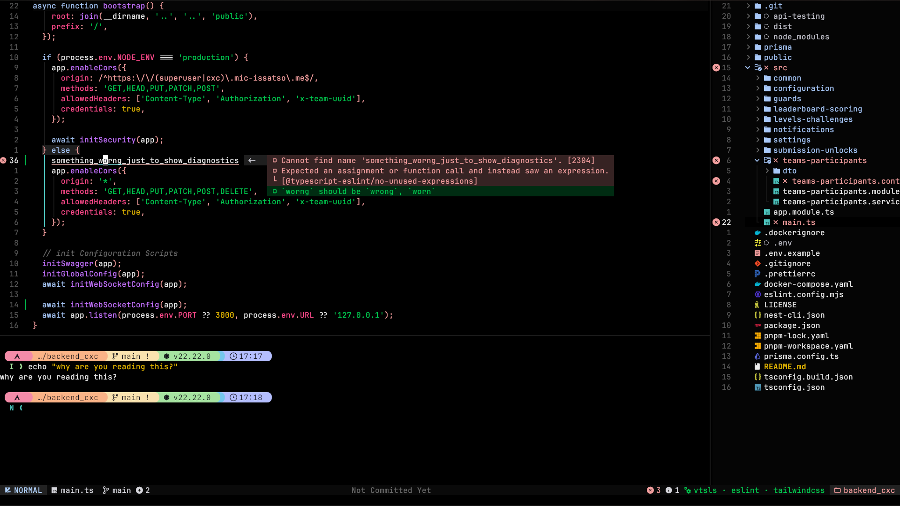

<h1 align="center">Neovim Configuration</h1>

<p align="center">Personal Neovim setup based on <a href="https://nvchad.com/">NvChad!</a></p>

<p align="center">
  
</p>

## Features

- **NvChad** as the base distribution
- **Lazy.nvim** for plugin management
- **LSP** with inline diagnostics and end hints
- **DAP** debugging support
- **Blink** completion
- **Git** integration (gitsigns, lazygit)
- **Rust** development (rustaceanvim, crates.nvim)
- **Python** venv support
- **Auto-save**, autopairs, surround, and more

## Installation

### Prerequisites

- Neovim
- Git
- A [Nerd Font](https://www.nerdfonts.com/)

### Install

```bash
# Backup existing config
mv ~/.config/nvim ~/.config/nvim.bak

# Clone this repo
git clone https://github.com/SlamZDank/nvim-dots.git ~/.config/nvim

# Start Neovim (plugins install automatically)
nvim
```

## Update

```bash
# Update plugins
nvim +"Lazy sync" +qa

# Or from inside Neovim
:Lazy sync
```

## Structure

```
~/.config/nvim/
├── init.lua              # Entry point
├── lua/
│   ├── chadrc.lua        # NvChad config
│   ├── options.lua       # Vim options
│   ├── mappings.lua      # Keybindings
│   ├── autocmds.lua      # Autocommands
│   ├── configs/          # Plugin configs
│   │   ├── lazy.lua
│   │   ├── lspconfig.lua
│   │   ├── conform.lua
│   │   └── dapconfig.lua
│   ├── plugins/          # Plugin specs
│   └── themes/           # Custom themes
└── lazy-lock.json        # Plugin lockfile
```
